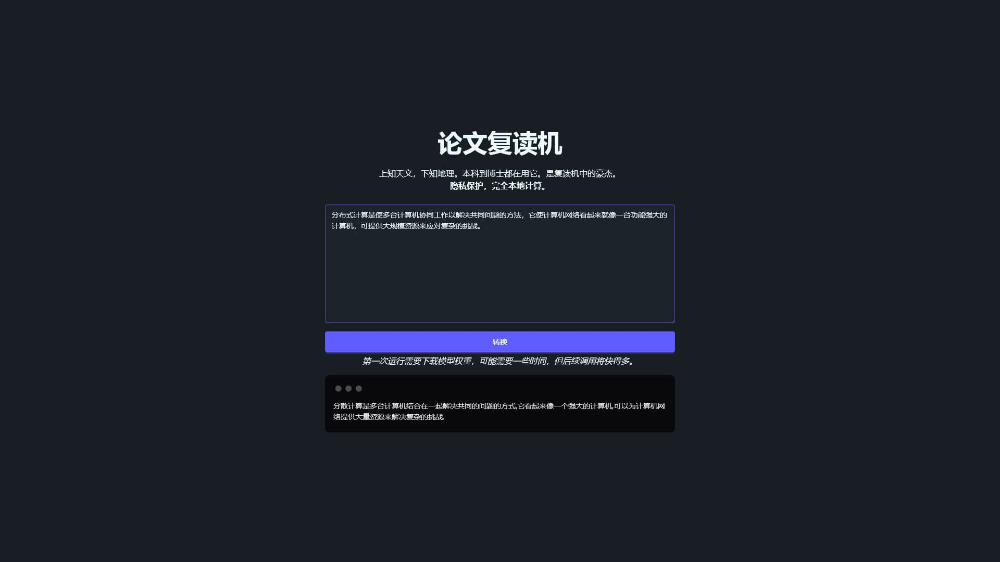

# 论文复读机

上知天文，下知地理。本科到博士都在用它。是复读机中的豪杰。

## 核心优势

| 功能特性           | 用户价值                                               |
| ------------------ | ------------------------------------------------------ |
| **LLM 本地计算**   | 隐私优先架构，不再依赖第三方接口，数据永不离开你的设备 |
| **浏览器点开即用** | 零门槛极速体验，无需安装，打开浏览器即刻使用           |
| **现代响应式设计** | 简洁美观的 UI，响应式布局适配所有设备                  |

## 在线体验

_TODO_

## 📸 项目截图

  
  
<em>项目主界面</em>

## 开源协议

[GNU Affero General Public License v3.0](LICENSE)
